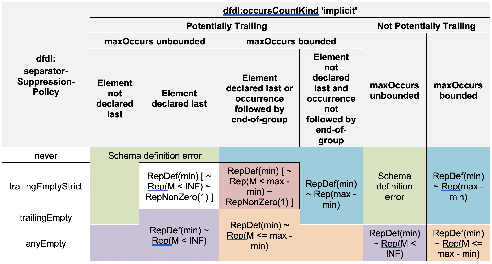
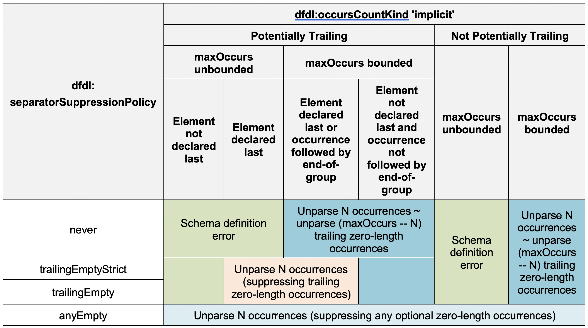

# 14. Sequence Groups

The following properties are specific to sequences.

<table>
  <thead>
    <tr>
      <th style="text-align:left"><b>Property Name</b>
      </th>
      <th style="text-align:left"><b>Description</b>
      </th>
    </tr>
  </thead>
  <tbody>
    <tr>
      <td style="text-align:left">sequenceKind</td>
      <td style="text-align:left">
        
Enum

        
Valid values are &apos;ordered&apos;, &apos;unordered&apos;

        
When &apos;ordered&apos;, this property means that the contained items
          of the sequence will be encountered in the same order that they appear
          in the schema, which is called schema-definition-order.

        
When &apos;unordered&apos;, this property means that the items of the
          sequence will be encountered in any order. Repeating occurrences of the
          same element do not need to be contiguous. The children of an unordered
          sequence must be xs:element otherwise it is a Schema Definition Error.

        
Annotation: dfdl:sequence, dfdl:group (sequence)

      </td>
    </tr>
    <tr>
      <td style="text-align:left">initiatedContent</td>
      <td style="text-align:left">
        
Enum

        
Valid values are &apos;yes&apos;, &apos;no&apos;

        
When &apos;yes&apos; indicates that all the children of the sequence are
          initiated. It is a Schema Definition Error if any children have their dfdl:initiator
          property set to the empty string.

        
If the child is optional then it is known to exist when its initiator
          has been found. Any subsequent error parsing the child will not cause the
          parser to backtrack to try other alternatives.

        
When &apos;no&apos;, the children of the sequence may have their dfdl:initiator
          property set to the empty string.

        
Annotation: dfdl:sequence, dfdl:choice, dfdl:group

      </td>
    </tr>
  </tbody>
</table>

Table 44 Properties for Sequence Groups

A sequence can have a dfdl:initiator and/or a dfdl:terminator as described earlier.

## 14.1 Empty Sequences

A sequence having no children is syntactically legal in DFDL. In the data stream, such a sequence can have non-zero length _**LeftFraming**_ and _**RightFraming**_ regions, but the SequenceContent region in between must be empty. It is a processing error if the SequenceContent region of an empty sequence has non-zero length when parsing.

XML schema does not define an empty sequence that is the content model of a complex type definition as effective content so any DFDL annotations on such a construct would be ignored. It is a Schema Definition Error if the empty sequence is the content model of a complex type, or if a complex type has nothing in its content model at all.

A hidden group reference is indicated in DFDL using an empty sequence such as

 `<xs:sequence dfdl:hiddenGroupRef="QName"/>`

To XML Schema this is an empty sequence group; hence it is a Schema Definition Error if this appears as the model group of a complex type. Otherwise this is not considered an empty sequence, but a group reference.

## 14.2 Sequence Groups with Separators

Additional properties apply to sequence groups that use text delimiters to separate one occurrence of a member of the group from the next. Such a delimiter is called a separator. DFDL provides several properties that control the parsing and writing of separators, and satisfy the requirement to model sequences where:

1. A separator has alternative potential representations in the data.
2. A separator is placed before, after, or between occurrences in the data.
3. Separators are used to indicate the position of occurrences in the data

These requirements are addressed by the properties dfdl:separator, dfdl:separatorPosition and dfdl:separatorSuppressionPolicy, as described below.

These properties combine to define the syntax for a sequence group with dfdl:sequenceKind 'ordered'. Not all combinations of the properties will give rise to consistent syntax, so some combinations are disallowed and will give rise to a Schema Definition Error.

In some sequences, the presence of separators alone is enough to establish occurrences within the sequence. Such a sequence is called a positional sequence.

_**Positional sequence -**_ Each occurrence in the sequence can be identified by its position in the data. Typically, the components of such a sequence do not have an initiator. In some such sequences, the separators for optional zero-length occurrences may or must be omitted when at the end of the group. In DFDL, a sequence is considered positional if it contains only required elements and/or optional and array elements that have dfdl:occursCountKind 'implicit', 'fixed' or 'expression', and it has dfdl:separatorSuppressionPolicy 'never', 'trailingEmptyStrict'  or 'trailingEmpty'.

_**Non-positional sequence**_ - Occurrences in the sequence cannot be identified by their position in the data alone. Often the components of such a sequence have an initiator. Such sequences sometimes allow the separator to be omitted for optional zero-length occurrences anywhere in the sequence. Speculative parsing might need to be employed by the parser to identify each occurrence. In DFDL, a sequence is non-positional if it contains any optional or array elements that have dfdl:occursCountKind 'parsed' or 'stopValue', and/or it has dfdl:separatorSuppressionPolicy 'anyEmpty'.

<table>
  <thead>
    <tr>
      <th style="text-align:left"><b>Property Name</b>
      </th>
      <th style="text-align:left"><b>Description</b>
      </th>
    </tr>
  </thead>
  <tbody>
    <tr>
      <td style="text-align:left">separator</td>
      <td style="text-align:left">
        
List of DFDL String Literals or DFDL Expression

        
Specifies a whitespace separated list of alternative DFDL String Literals
          that are the possible separators for the sequence. Separators occur in
          the data either before, between or after all occurrences of the elements
          or groups that are the children of the sequence, in accordance with dfdl:separatorPosition
          and dfdl:separatorSuppressionPolicy. Elements with dfdl:inputValueCalc
          have no representation in the data stream, and so never have an associated
          separator.

        
This property can be computed by way of an expression which returns a
          string of whitespace separated values. The expression must not contain
          forward references to elements which have not yet been processed. It is
          a Schema Definition Error if the expression returns an empty string.

        
This property can be used to determine the length of an element as described
          in Section <a href>12.3.2</a> dfdl:lengthKind &apos;delimited&apos;.

        
Each string literal in the list, whether apparent in the schema, or returned
          as the value of an expression, is restricted to allow only certain kinds
          of DFDL String Literal syntax:

        <ul>
          <li>DFDL character entities are allowed.</li>
          <li>DFDL Byte Value entities ( %#rXX; ) are allowed.</li>
          <li>DFDL Character Class ES is not allowed.</li>
          <li>DFDL Character Classes NL, WSP, WSP+, and WSP* are allowed.</li>
          <li>The WSP* entity cannot appear on its own as one of the string literals
            in the list when determining the length of a component by scanning for
            delimiters.</li>
        </ul>
        
If the above rules are not followed it is a Schema Definition Error.

        
The <em><b>Separator, PrefixSeparator</b></em> and <em><b>PostfixSeparator</b></em> regions
          contain one of the strings specified by the dfdl:separator property. When
          this property has &quot;&quot; (empty string) as its value then the separator
          region is of length zero.

        
When parsing, the list of values is processed in a greedy manner, meaning
          it takes all the separators, that is, each of the string literals in the
          whitespace separated list, and matches them each against the data. The
          separator with the longest match is the one that is selected as having
          been &apos;found&apos;. Once a matching separator is found, no other matches
          will be subsequently attempted (i.e., there is no backtracking).

        
On unparsing the first separator in the list is used as the separator.

        
If a child element uses an escape scheme, then the escape scheme also
          applies to any separator; hence, if the separator appears within the element
          value, it will be escaped.

        
If dfdl:ignoreCase is &apos;yes&apos; then the case of the string is ignored
          by the parser.

        
Annotation: dfdl:sequence, dfdl:group (sequence)

      </td>
    </tr>
    <tr>
      <td style="text-align:left">separatorPosition</td>
      <td style="text-align:left">
        
Enum

        
Valid values &apos;infix&apos;, &apos;prefix&apos;, &apos;postfix&apos;

        
&apos;infix&apos; means the separator occurs between the elements in the <em><b>Separator</b></em> grammar
          region.

        
&apos;prefix&apos; means the separator occurs before each element in the <em><b>Separator</b></em> grammar
          region and the <em><b>PrefixSeparator</b></em> grammar region.

        
&apos;postfix&apos; means the separator occurs after each element in the <em><b>Separator</b></em> grammar
          region and the <em><b>PostfixSeparator</b></em> grammar region.

        
Annotation: dfdl:sequence, dfdl:group (sequence).

      </td>
    </tr>
    <tr>
      <td style="text-align:left">separatorSuppressionPolicy</td>
      <td style="text-align:left">
        
Enum

        
Valid values &apos;never&apos;, &apos;anyEmpty&apos;, &apos;trailingEmpty&apos;,
          &apos;trailingEmptyStrict&apos;

        
Only applicable if dfdl:separator is not &quot;&quot; (empty string) and
          dfdl:sequenceKind is &apos;ordered&apos;.

        
Controls the circumstances when separators are expected in the data when
          parsing, or generated when unparsing, if an optional element occurrence
          or a group has a zero-length representation.

        
See section 14.2.1 Separators and Suppression.

        
When dfdl:sequenceKind is &apos;unordered&apos; then &apos;anyEmpty&apos;
          is implied.

        
Annotation: dfdl:sequence, dfdl:group (sequence)

      </td>
    </tr>
  </tbody>
</table>

Table 45 Properties for Sequence Groups with Separators

### 14.2.1 Separators and Suppression

When parsing a sequence group that specifies a separator, the number of occurrences and separators that are expected in the data stream for a child \(element or group\) depends on several factors:

* Whether element occurrences are optional or required
* Whether the occurrences \(element or group\) have a zero-length representation
* Whether occurrences \(element or group\) are trailing
* Whether the sequence is positional
* The dfdl:occursCountKind of the element

Where to expect a separator for optional content of zero-length is controlled by property dfdl:separatorSuppressionPolicy.

| separatorSuppressionPolicy | Implications |
| :--- | :--- |
| never | Positional sequence where all occurrences must be found in the data, along with their associated separator. |
| trailingEmptyStrict | Positional sequence where trailing occurrences that have zero length representation must be omitted from the data, along with their associated separator. |
| trailingEmpty | Positional sequence where trailing occurrences that have zero length representation may be omitted from the data, along with their associated separator. |
| anyEmpty | Non-positional sequence where any occurrences that have zero length representation may be omitted from the data, along with their associated separator. It must be possible for speculative parsing to identify which elements are present. |

Table 46 Sequence groups and separator suppression

The following are definitions for terminology used in this section:

_**Potentially trailing element**_ – An array or optional element describes an occurrence that is said to be potentially trailing if the element can have a zero length representation and is followed in its enclosing group definition by only these kinds of schema components:

1. calculated elements \(those having dfdl:inputValueCalc\)
2. additional potentially trailing elements
3. potentially trailing groups

Intuitively, the array or optional element occurrence could be last.

_**Potentially trailing group**_ – A group is said to be potentially trailing if the group has no framing and contains only potentially trailing element declarations/references, or recursively similar sequence or choice groups, and is followed in its enclosing group definition by only additional potentially trailing elements or potentially trailing groups.

_**Trailing or Actually Trailing**_ – An element occurrence or group occurrence in the data is said to be _actually trailing_ if it is potentially trailing and has zero-length representation and is not followed in the data by any other non-zero length element occurrence or group occurrence limited by the end of the enclosing sequence group.

In the sections that follow, it is important to remember that the dfdl:separatorSuppressionPolicy property is carried on the sequence, while the XSD minOccurs, XSD maxOccurs and dfdl:occursCountKind properties are carried on an element in that sequence.

### 14.2.2 Parsing Sequence Groups with Separators

Parsing child elements is described first. Parsing for child groups is described in Section 14.2.2.3.

When an element is required and is not an array then one occurrence is always expected along with its separator. The dfdl:separatorSuppressionPolicy of the sequence has no effect \(nothing is eligible for suppression\). Otherwise the behaviour is dependent on dfdl:occursCountKind.

When dfdl:occursCountKind is 'fixed' then XSD minOccurs must equal maxOccurs and that many occurrences are always expected along with their separators. The dfdl:separatorSuppressionPolicy of the sequence has no effect \(nothing is eligible for suppression\).

When dfdl:occursCountKind is 'expression' the number of occurrences is given by dfdl:occursCount and exactly that many occurrences are always expected along with their separators. The dfdl:separatorSuppressionPolicy of the sequence has no effect \(nothing is eligible for suppression\).

When dfdl:occursCountKind is 'parsed' any number of occurrences and their separators are expected. The dfdl:separatorSuppressionPolicy of the sequence must be 'anyEmpty' and it is a Schema Definition Error otherwise.

When dfdl:occursCountKind is 'stopValue', any number of occurrences and their separators are expected followed by the stop value and its separator. The dfdl:separatorSuppressionPolicy of the sequence has no effect.

When dfdl:occursCountKind is 'implicit', between XSD minOccurs and XSD maxOccurs \(inclusive\) occurrences and their separators are expected, according to the dfdl:separatorSuppressionPolicy of the sequence.

The behaviour for 'implicit' is more fully expressed in matrix form. The cells in the matrix give the number of occurrences of element values that are expected in the data stream when parsing, for the different values of dfdl:separatorSuppressionPolicy. The number of occurrences also depends whether XSD maxOccurs is unbounded or not, and the position of the element in the sequence. The number of separators can be inferred from this, considering dfdl:separatorPosition.

The notation in each cell uses the "~" symbol to mean "followed by" in the data stream. Square brackets surround things that are optional, as in they may or may not appear in the data stream.

The descriptions found in the cells of the matrix do not provide a parsing algorithm, but rather state declaratively a pattern that the data must match in order to be correctly parsed.

_**RepDef\(min\)**_ is short for "representation" and "defaultable". It means XSD minOccurs occurrences of nil, empty or normal representation\[42\]. These are required occurrences, so default rules apply for empty representations. XSD minOccurs may be 0, in which case there are no required occurrences.

_**Rep\(M\)**_ means M occurrences of nil, empty, normal or absent representation. These are optional occurrences, so default rules do not apply for empty representations.

_**RepNonZero\(1\)**_ means an occurrence of a nil, empty or normal representation where such a representation does not have zero-length\[43\]. This is an optional occurrence, so default rules do not apply.

A notation like _**Rep\(M &lt;= max – min\)**_ means that there are M occurrences, where M is some value between the values of the XSD minOccurs and XSD maxOccurs properties. When an unbounded number of occurrences is possible this is shown explicitly by Rep\(M &lt; INF\) , INF meaning infinity or unbounded.

\[42\] Absent representation implies processing error for ‘implicit’ when less than or equal to XSD minOccurs. 

\[43\] Absent representation always implies zero-length. Nil, empty, and normal representations can also be zero-length with the right combinations of properties. See Section 9.3.5 Zero-length Representation.

#### 14.2.2.1 Errors When the Sequence is Positional

In the matrix above we see that there are some cells where the combination of properties doesn't make sense, and a Schema Definition Error is raised. These occur when an element has dfdl:occursCountKind 'implicit' and XSD maxOccurs 'unbounded', and dfdl:separatorSuppressionPolicy implies that the sequence is positional, specifically:

* If a sequence has dfdl:separatorSuppressionPolicy 'never';
* If a sequence has dfdl:separatorSuppressionPolicy 'trailingEmptyStrict' or 'trailingEmpty' and the element is not the last declaration in the sequence. \(This avoids ambiguity about which element is being suppressed.\)

#### 14.2.2.2 Example Parsing Scenarios

Consider the cell of the matrix above for the element in this DFDL schema fragment:  
`<xs:sequence dfdl:separator='|' dfdl:separatorPosition='infix'  
 dfdl:separatorSuppressionPolicy='trailingEmptyStrict'>  
 <xs:element name='a' type='xs:int' default='0'  
 maxOccurs='5' minOccurs='0'  
 dfdl:representation='text' dfdl:textNumberPattern='#0'  
 dfdl:occursCountKind='implicit'  
 dfdl:initiator='[' dfdl:terminator=']'  
 dfdl:emptyValueDelimiterPolicy='both' />  
</xs:sequence>`

Within the sequence this element 'a' is clearly potentially trailing as it is declared last. The corresponding cell in the matrix above contains this description:

_RepDef\(min\) \[~ Rep\(M &lt; max – min\) ~ RepNonZero\(1\) \]_

Since XSD minOccurs='0', the first term, RepDef\(min\) vanishes. So, we have left

_Rep\(M &lt; max - min\) ~ RepNonZero\(1\)_

Note Rep\(M\) permits absent representations, and if encountered they will simply be omitted from the Infoset.

So, this data

`[1]|[2]|[3]|[4]|[5]`

parses and 5 items appear in the Infoset.

This data

`|||[4]`

also parses because absent representations are accepted, but only one item appears in the Infoset.\(The fact that the occurrence was fourth in the array is not preserved into the Infoset\). However, this data

`|||[4]|`

causes a processing error because there is a final trailing separator and dfdl:separatorSuppressionPolicy is 'trailingEmptyStrict'.

Now consider the same scenario but XSD minOccurs of '2'. The first term reappears as RepDef\(2\). The data

`|||[4]`

which previously parsed successfully would now cause a processing error because the first two occurrences are required, so they must be either a normal representation, that is, matching xs:int syntax with surrounding initiator and terminator, or the empty representation which is \[\]. An example which will parse correctly with XSD minOccurs of '2' is:

`[1]|[]||[4]`

In this case the Infoset will contain 3 items with values 1, 0, 4. The 0 value arises because the occurrence has the empty representation, the occurs index is 2 so it is required, and there is a default value 0.

If the scenario is changed so that dfdl:separatorSuppressionPolicy is 'trailingEmpty' then a different cell of the matrix above applies.

_RepDef\(min\) \[~ Rep\(M &lt; max – min\) \]_

This has a more lax behavior so that this data is also acceptable:

`[1]|[]||[4]|`

In this case the final trailing separator is tolerated, though when unparsing this final trailing separator would not be created. This is a case where what is parsed will not be exactly recreated on unparsing from the resulting Infoset, but all the information content is preserved.

Now consider the same scenario but XSD maxOccurs is 'unbounded'. In that case this data is acceptable:

`[1]|[]||||||||||||||||||||||||[4]|||||||||||||||||||||`

The Infoset values are again 1, 0, 4. But all the excess separators are tolerated.

#### 14.2.2.3 Parsing Child Groups within Separated Sequences

When a child of a sequence is a group then a separator is expected/tolerated depending on dfdl:separatorSuppressionPolicy and other factors:

* ‘never’ - the child group’s associated separator is expected
* ‘trailingEmpty’ – if the child group is potentially trailing, has zero-length and it is actually trailing, its separator may appear or not. Additional separators are not expected.
* ‘trailingEmptyStrict’ – if the child group is potentially trailing, has zero-length and it is actually trailing, its separator must not appear.
* ‘anyEmpty’ – if the child group has zero-length its separator must not appear.

### 14.2.3 Unparsing Sequence Groups with Separators

Unparsing child elements is described first. Unparsing for child groups is described in Section 14.2.3.2.

When an element is required and is not an array then one occurrence is always output along with its separator. The dfdl:separatorSuppressionPolicy of the sequence has no effect \(nothing is eligible for suppression\).

Otherwise the behaviour is dependent on dfdl:occursCountKind.

When dfdl:occursCountKind is 'fixed' or 'expression' the occurrences in the augmented Infoset are always output along with their separators. The dfdl:separatorSuppressionPolicy of the sequence has no effect \(nothing is eligible for suppression\).

When dfdl:occursCountKind is 'parsed' non zero-length occurrences in the augmented Infoset are output along with their separators. The dfdl:separatorSuppressionPolicy of the sequence must be 'anyEmpty' and it is a Schema Definition Error otherwise.

When dfdl:occursCountKind is 'stopValue' the occurrences in the augmented Infoset are output along with their separators followed by the stop value and its separator, according to the dfdl:separatorSuppressionPolicy of the sequence.

When dfdl:occursCountKind is 'implicit' the occurrences in the augmented Infoset are output along with their separators, according to the dfdl:separatorSuppressionPolicy of the sequence.

The behaviour for 'implicit' is more fully expressed in matrix form. The cells in the matrix give the number of occurrences of element values that are output to the data stream when unparsing, for the different values of dfdl:separatorSuppressionPolicy. The number of occurrences also depends whether XSD maxOccurs is unbounded or not, and the position of the element in the sequence. The number of separators output can be inferred from this, considering dfdl:separatorPosition.

The notation in each cell uses the "~" symbol to mean "followed by" in the output data stream.

_**N**_ stands for the number of elements in the augmented Infoset, which includes any defaults.

_**unparse N occurrences**_ means output N unparsed Infoset items and associated separators.

_**unparse\(M\) trailing zero length occurrences**_ means output M adjacent separators \(according to dfdl:separatorPosition\) as if separating M element occurrences.

_**\(suppressing trailing zero-length reps\)**_ implies the unparser MUST look ahead into the Infoset and determine when the representations will be zero-length, and then identify those in trailing position. No separators are output corresponding to the trailing zero-length representations.

#### 14.2.3.1 Example Unparsing Scenarios

Consider the cell of the matrix above for the element in this DFDL schema fragment:  
`<xs:sequence dfdl:separator='|' dfdl:separatorPosition='infix'  
 dfdl:separatorSuppressionPolicy='trailingEmpty'>  
 <xs:element name='a' type='xs:int'  
 maxOccurs='5' minOccurs='0'  
 nillable='true'  
 dfdl:representation='text' dfdl:textNumberPattern='#0'  
 dfdl:occursCountKind='implicit'  
 dfdl:initiator='[' dfdl:terminator=']'  
 dfdl:emptyValueDelimiterPolicy='none'  
 dfdl:nilKind='literalValue' dfdl:nilValue='%ES;'  
 dfdl:nilValueDelimiterPolicy='none' />  
</xs:sequence>`

This example is similar to the one used above in the discussion of parsing with separator suppression. However, the element has no default value, the dfdl:emptyValueDelimterPolicy has been removed, and the element is nillable. Element 'a' is clearly potentially trailing as it is declared last. The corresponding cell in the matrix above contains this description:

_unparse N occurrences \(suppressing trailing zero length reps\)_

Assume we are unparsing an Infoset containing five values: 1, 0, nil\[44\], 4, nil. We will unparse the five occurrences; however, the last value is nil, which has a representation of '%ES;' meaning empty-string, and dfdl:nilvalueDelimiterPolicy is 'none' meaning no initiator or terminator is to appear in the data. Since we are suppressing trailing zero-length reps the unparse results in this output:

`[1]|[0]||[4]`

We see here an example where if we reparsed the data we would not get back the same Infoset that we started from because the trailing empty value which is the representation of the nil value, is not represented in the output, and so will not cause an Infoset item with **\[nilled\]** true to be created in the Infoset when this data is parsed. To preserve the nil, we would have to change the dfdl:nilValueDelimiterPolicy to 'both', and in that case the output would be:

`[1]|[0]|[]|[4]|[]`

The nils now have explicit representation in the data and will be recreated in the Infoset when parsing.

\[44\] An Infoset item value of nil means the Infoset item **\[nilled\]** member is true, and the **\[dataValue\]** member has no value. See Section 4.2.2 Element Information Items.

#### 14.2.3.2 Unparsing Child Groups within Separated Sequences

When a child of a sequence is a group then a separator is output depending on dfdl:separatorSuppressionPolicy and other factors:

1. ‘never’ - the child group’s associated separator is output
2. ‘trailingEmpty’ or ‘trailingEmptyStrict’ – if the child group is potentially trailing, has zero-length and it is actually trailing, its separator is not output.
3. ‘anyEmpty’ – if the child group has zero-length its separator is not output.

## 14.3 Unordered Sequence Groups

The occurrences of members of a sequence group with dfdl:sequenceKind of 'unordered' \(hereafter referred to as an 'unordered sequence'\) may appear in the data in any order. Occurrences of the same member do not have to be contiguous. In the Infoset, sequence groups are always in schema order, so a DFDL processor MUST sort the members of an unordered sequence into schema order when parsing. When unparsing, the Infoset must already be in schema order, and the members of the sequence will be output in schema order.

### 14.3.1 Restrictions for Unordered Sequences

It is a Schema Definition Error if any member of the unordered sequence is not an element declaration or an element reference.

It is a Schema Definition Error if a member of an unordered sequence is an optional element or an array element and its dfdl:occursCountKind property is not 'parsed'

It is a Schema Definition Error if two or more members of the unordered sequence have the same name and the same namespace \(see post-processing transformation below\)

It is a Schema Definition Error if an unordered sequence has no members.

### 14.3.2 Parsing an Unordered Sequence

When parsing, the semantics of an unordered sequence are expressed by way of:

1. a source-to-source transformation of the sequence group definition, and
2. a post-processing transformation of the Infoset .

An implementation MAY use any technique consistent with this semantic.

#### 14.3.2.1 Source-to-source Transformation

The source-to-source transformation turns the declaration of an unordered sequence into an ordered sequence group that contains a repeating choice. To ensure that the resulting schema is a valid DFDL schema, the choice group is wrapped in an array element.

The unordered sequence is transformed as follows:

* the dfdl:sequenceKind property of the unordered sequence is changed to "ordered"
* the content of the unordered sequence is replaced by a complex element \( the 'choice element' \) with the following properties:
  * XSD minOccurs="0"
  * XSD maxOccurs="unbounded"
  * dfdl:lengthKind "implicit"
  * dfd:occursCountKind "parsed"
* the content of the choice element's complex type is a choice group with the following properties:
* dfdl:choiceLengthKind "implicit"
* The members of the unordered sequence become the members of the choice group, with their declaration order preserved.
* The XSD minOccurs and XSD maxOccurs properties on each member of the choice group are both set to 1.

Using the following example as an illustration:  
`<xs:sequence dfdl:sequenceKind="unordered" dfdl:separator=",">  
 <xs:element name="a" type="xs:string" dfdl:initiator="A:" />  
 <xs:element name="b" type="xs:int" minOccurs="0" dfdl:initiator="B:" />  
 <xs:element name="c" type="xs:string" minOccurs="0" maxOccurs="10"  
 dfdl:initiator="C:" />  
</xs:sequence>`

The above unordered sequence group is conceptually rewritten into the following ordered sequence group:  
`<xs:sequence dfdl:sequenceKind="ordered" dfdl:separator=",">  
 <xs:element name="choiceElement" minOccurs="0" maxOccurs="unbounded"  
 dfdl:occursCountKind="parsed">  
 <xs:complexType>  
 <xs:choice dfdl:choiceLengthKind="implicit">  
 <xs:element name="a" type="xs:string" dfdl:initiator="A:" />  
 <xs:element name="b" type="xs:int" dfdl:initiator="B:" />  
 <xs:element name="c" type="xs:string" dfdl:initiator="C:" />  
 </xs:choice>  
 </xs:complexType>  
 </xs:element>  
</xs:sequence>`

Processing then constructs a temporary info set for this ordered sequence group by parsing the data.

If a member element is found to have the empty representation then the parsing of that element must use the original value of XSD minOccurs. In this example, element "b" has XSD minOccurs "0" and if it is found with the empty representation then it must not be defaulted.

#### 14.3.2.2 Post-processing Transformation

Post-processing consists of the following steps:

1. Sort the temporary Infoset to produce the real Infoset
2. Check scalar elements and validate

**Step 1: Sort the Temporary Infoset**

The temporary Infoset is transformed into the Infoset conforming to the original unordered sequence. All members of the temporary Infoset having the same name and namespace as the first child of the unordered sequence are placed first, in the order in which they were parsed. This algorithm repeats for the second child of the unordered sequence and so on until all members of the temporary Infoset have been sorted into the schema declaration order of the original unordered sequence.

For the example above, the temporary Infoset is transformed into the Infoset corresponding to:

`<xs:sequence>  
 <xs:element name="a" type="xs:string" />  
 <xs:element name="b" type="xs:int" minOccurs="0" />  
 <xs:element name="c" type="xs:string" minOccurs="0" maxOccurs="10" />  
</xs:sequence>`

**Step 2: Check Scalar Elements and Validate**

For each element in the unordered sequence having XSD minOccurs "1" and maxOccurs "1", the number of occurrences is checked. Each such element must occur exactly once in the Infoset, else it is a processing error.

If validation is enabled, the DFDL processor validates the number of occurrences of each member of the unordered sequence against XSD minOccurs and XSD maxOccurs.

These checks are the same as those performed for an ordered sequence group. However, in an unordered sequence the checking of XSD minOccurs and XSD maxOccurs MUST be performed after the entire group has been parsed.

### 14.3.3 Unparsing an Unordered Sequence

When unparsing, the behavior is exactly as if dfdl:sequenceKind is 'ordered'. The members of the unordered sequence group are output in schema declaration order.

## 14.4 Floating Elements

Elements within an ordered sequence can be designated as floating which means that they can appear in any position within the sequence.\[45\]

An ordered sequence with floating components is similar to an unordered sequence except only the floating elements may be out of order.

Within an ordered sequence with floating components a non-floating array element must have its occurrences appearing contiguously, so any floating elements cannot appear in between occurrences of the array element.\(In other words, property dfdl:floating 'yes' only makes a statement about the floating element, not about any other elements in the sequence.\)

<table>
  <thead>
    <tr>
      <th style="text-align:left"><b>Property Name</b>
      </th>
      <th style="text-align:left"><b>Description</b>
      </th>
    </tr>
  </thead>
  <tbody>
    <tr>
      <td style="text-align:left">floating</td>
      <td style="text-align:left">
        
Enum

        
Valid values are &apos;yes&apos;, &apos;no&apos;

        
Whether the occurrences of an element in an ordered sequence can appear
          out-of-order in the representation.

        
When parsing, and dfdl:floating is &apos;yes&apos;, occurrences of the
          element may be encountered in the representation in many positions within
          its containing sequence. If present they are placed into the Infoset in
          schema declaration order. If the element repeats, occurrences do not need
          to be contiguous in the representation.

        
When parsing, and dfdl:floating is &apos;no&apos;, occurrences of the
          element must be in schema declaration order, and, if present, they are
          placed into the Infoset in schema declaration order. It is a processing
          error if instances of the element are not encountered in schema declaration
          order.

        
When unparsing, occurrences of the element are expected in the Infoset
          in schema declaration order and are output in the representation in schema
          declaration order. It is a processing error if occurrences of the element
          are not encountered in schema declaration order,

        
It is a Schema Definition Error if an unordered sequence or a choice contains
          any element with dfdl:floating &apos;yes&apos;.

        
It is a Schema Definition Error if an ordered sequence contains any element
          with dfdl:floating &apos;yes&apos; and also contains non-element component
          (such as a choice or sequence model group).

        
It is a Schema Definition Error if an element with dfdl:floating &apos;yes&apos;
          is an optional element or an array element and its dfdl:occursCountKind
          property is not &apos;parsed&apos;

        
It is a Schema Definition Error if two or more elements with dfdl:floating
          &apos;yes&apos; in the same group have the same name and the same namespace.

        
Annotation: dfdl:element

      </td>
    </tr>
  </tbody>
</table>

Table 49 Properties for Floating Elements

An ordered sequence of N element children with dfdl:floating 'yes' is equivalent to an unordered sequence with the same N element children with dfdl:floating 'no'.

A complex element with dfdl:floating 'yes' can have as its content model a sequence with elements that also have dfdl:floating 'yes'.

Every element in a sequence containing one or more floating elements is a point of uncertainty, similar to the way every element in an unordered sequence is a point of uncertainty.

In resolving this point of uncertainty, a parser MUST look for the element defined at that position in the schema first and only if unsuccessful with parsing that element, the parser MUST subsequently attempt to parse the floating elements in the order they are defined in the schema. As soon as any such parse is successful this resolves the point of uncertainty.

\[45\] The NTE segment in the X12 EDI standard is an example of a floating element.

## 14.5 Hidden Groups

Some fields in the physical stream provide information about other fields in the stream and are not really part of the data. For example, a field could give the number of repeats in a following array. These fields may not be of interest to an application after the data has been parsed, and so may be removed from the Infoset on parsing by containing the element declarations for them within a hidden group. A hidden group allows elements to be defined that will not be added to the Infoset on parsing and will not be expected in the Infoset on unparsing.

`<xs:element name="root">  
 <xs:complexType>  
 <xs:sequence>  
 <xs:sequence>  
 <xs:annotation><xs:appinfo source="http://www.ogf.org/dfdl/">  
 <dfdl:sequence hiddenGroupRef="tns:hiddenRepeatCount">  
 </xs:appinfo></xs:annotation>  
 </xs:sequence>  
 <xs:element name="arrayElement" type="xs:int"  
 minOccurs="0" maxOccurs="unbounded"  
 dfdl:occursCountKind="expression"  
 dfdl:occurCount= "{../repeatCount}"  
 dfdl:representation="binary" dfdl:lengthKind="implicit" />  
 </xs:sequence>  
 </xs:complexType>  
</xs:element>  
<xs:group name="hiddenRepeatCount" >  
  <xs:sequence>  
    <xs:element name="repeatCount" type="xs:int"  
 dfdl:outputValueCalc="{count(../arrayElement)}"  
 dfdl:representation="binary" dfdl:lengthKind="implicit" />  
  </xs:sequence>  
</xs:group>`

An element contained within the extent of a hidden group is commonly called a hidden element.

Hidden elements are referenced via path expressions using the same DFDL expression that would be used if they were not hidden.

Hidden elements can \(typically will\) contain the regular DFDL annotations to define their physical properties and on unparsing to set their value. They are processed using the same behavior as non-hidden elements.

When the dfdl:hiddenGroupRef property is specified on an xs:sequence schema component, the appearance of any other DFDL properties on that component is a Schema Definition Error. It is also a Schema Definition Error if the sequence is not empty.

It is a Schema Definition Error if the sequence is the only thing in the content model of a complex type definition.

It is a Schema Definition Error if dfdl:hiddenGroupRef appears on a xs:group reference, that is, unlike most format properties that apply to sequences, dfdl:hiddenGroupRef cannot be combined from a xs:group reference.

A hidden group may appear within another hidden group.

<table>
  <thead>
    <tr>
      <th style="text-align:left"><b>Property Name</b>
      </th>
      <th style="text-align:left"><b>Description</b>
      </th>
    </tr>
  </thead>
  <tbody>
    <tr>
      <td style="text-align:left">hiddenGroupRef</td>
      <td style="text-align:left">
        
QName

        
Reference to a global model group definition. Elements within this model
          group will not be added to the Infoset and are called hidden elements.

        
The model group within the model group definition may be a xs:sequence
          or xs:choice

        
It is a Schema Definition Error if the value is the empty string.

        
It is not possible to place this property in scope on a dfdl:format annotation.

        
Annotation: dfdl:sequence

      </td>
    </tr>
  </tbody>
</table>

Table 50 Properties for Hidden Groups

When unparsing a hidden group, the behaviour is the same as when elements are missing from the Infoset; that is, the default-values algorithm applies. The only difference is that if a required element does not have a default value or a dfdl:outputValueCalc then it is a Schema Definition Error instead of a processing error. Note that this can be checked statically.

When unparsing a hidden group, it is a processing error if an element information item is provided in the Infoset for a hidden element.

