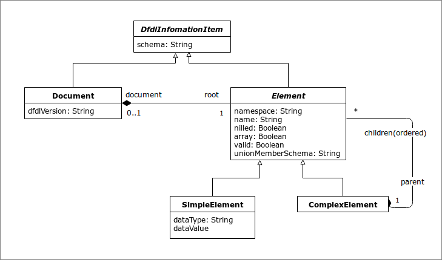

# 4. The DFDL Information Set \(Infoset\)

This section defines an abstract data set called the _**DFDL Information Set**_ \(_**Infoset**_\). Its purpose is to define the abstract data structure that is provided:

* to an invoking application by a DFDL parser when parsing DFDL-described data using a DFDL Schema;
* to a DFDL unparser by an invoking application when generating DFDL-described data using a DFDL Schema

The DFDL Infoset contains enough information so that a DFDL schema can be defined that will unparse the Infoset and reparse the resultant data stream to produce the same Infoset.

There is no requirement for DFDL-described data to be valid in order to have a DFDL information set.

Figure 1 DFDL Infoset Object Model

The DFDL information set is presented above in Figure 1 DFDL Infoset Object Model as an object model using a Unified Modeling Language \(UML\) class diagram, augmented using the Object Constraint Language \(OCL\) \[UML\].

The structure of the information set follows the Composite design pattern. In case of inconsistency or ambiguity, the following discussion takes precedence.

DFDL can describe the format of the physical representation for data whose structure conforms to this model. Note that this model allows hierarchically nested data but does not allow representation of arbitrary connected graphs of data objects.

DFDL information sets may be created by methods \(not described in this specification\) other than parsing DFDL-described data.

A DFDL information set consists of a number of _**information items**_; or just items for short. The information set for any well-formed DFDL-described data will contain at least a document information item and one element information item. An information item is an abstract description of a part of some DFDL-described data: each information item has a set of associated named _**members**_. In this specification, the member names are shown in square brackets, **\[thus\]**. The types of information item are listed in Section 4.2 Information Items.

The DFDL Information Set does not require or favor a specific implementation interface paradigm. This specification presents the information set as a modified tree for the sake of clarity and simplicity, but there is no requirement that the DFDL Information Set be made available through a tree structure; other types of interfaces, including \(but not limited to\) event-based and query-based interfaces, are also capable of providing information conforming to the DFDL Information Set.

The terms "information set" and "information item" are similar in meaning to the generic terms "tree" and "node", as they are used in computing. However, the former terms are used in this specification to reduce possible confusion with other specific data models.

The DFDL Information Set is similar in purpose to the XML Information Set \[XMLInfoset\], however, it is not identical, nor a perfect subset, as there are important differences such as that the DFDL Infoset does not have ‘text’ nodes that are a primary feature of the XML Infoset and the contents of strings is much less restricted in the DFDL Infoset.

### 4.1 "No Value''

In the discussion of Information Items and their members below, some members may sometimes have the value _**no value**_, and it is said that such a member has no value. This value is distinct from all other values. In particular it is distinct from the empty string, the empty set, and the empty list, each of which simply has no members. The concept of no-value is also orthogonal to how nillable elements are represented in the Infoset, which uses a separate **\[nilled\]** boolean flag, not a distinguished value.

### 4.2 Information Items

An information set contains two different types of information items, as explained in the following sections. Every information item has members. For ease of reference, each member is given a name, indicated **\[thus\]**.

#### 4.2.1 Document Information Item

There is exactly one _**document information item**_ in the information set, and all other information items are accessible through the \[root\] member of the document information item.

There is no specific DFDL schema component that corresponds to this item. It is a concrete artifact describing the information set.

The document information item has the following members:

**\[root\]** The element information item corresponding to the root element declaration of the DFDL Schema.

**\[dfdlVersion\]** String. The version of the DFDL specification to which this information set conforms. For DFDL V1.0 this is 'dfdl-1.0'

**\[schema\]** String. This member is reserved for future use.

#### 4.2.2 Element Information Items

There is an _**element information item**_ for each value parsed from the non-hidden DFDL-described data. This corresponds to an occurrence of a non-hidden element declaration of simple type in the DFDL Schema and is known as a _**simple element information item**_.

There is an _**element information item**_ for each explicitly declared structure in the DFDL-described data. This corresponds to an occurrence of an element declaration of complex type in the DFDL Schema and is known as a _**complex element information item**_.

In this information set, as in an XML document, an array is just a set of adjacent elements with the same name and namespace.

The \[root\] member of the document information item corresponds to the root element declaration of a DFDL Schema, and all other element information items are accessible by recursively following its \[children\] member.

An element information item has the following members:

**\[namespace\]** String. The namespace, if any, of the element. If the element does not belong to a namespace, the value is the empty string.

**\[name\]** String. The local part of the element name.

**\[document\]** The document information item representing the DFDL information set that contains this element. This element is empty except in the root element of an information set.

**\[dataType\]** String. The name of the XML Schema 1.0 built-in simple type to which the value corresponds. DFDL supports a subset of these types listed in Section 5.1 DFDL Simple Types.

**\[nilled\] Boolean. True if the nillable item is nil. False if the nillable item is not nil. If the element is not nillable this member has no value. If this member is true then for a simple element the \[dataValue\] member has no value, and for a complex element the \[children\] member has no value. If this member is true, then the Infoset item is said to be nil or nilled.**

**\[array\]** Boolean. True if the item is an array, meaning that it corresponds to an element having maxOccurs value greater than 1, or ‘unbounded’.

**\[children\]** An ordered set of zero or more element information items. The order they appear in the set is the order implied by the DFDL Schema. 'Ordered set' is not formally defined here, but two operations are assumed: 'count' gives the number of information items, and 'at \(index\)' gives the element at ordinal position 'index' starting from 1. In a simple element information item this member has no value. In a document information item this member contains exactly one element information item. If the **\[nilled\]** member is true, then this member has no value.

**\[parent\]** The complex element information item which contains this information item in its \[children\] member. In the root element of an information set this member is empty.

**\[schema\]** String. A reference to a schema component associated with this information item, if any. If not empty, the value MUST be an absolute or relative Schema Component Designator \[SCD\].

**\[valid\]** Boolean\[4\]. True if the element is valid as determined by a DFDL implementation that performs validation checking. A complex element information item is not valid if any of its **\[children\]** are not valid. Empty if validation is not enabled.

**\[unionMemberSchema\]**\[5\] String. For simple element information items, this member contains an SCD reference to the member of the union that matched the value of the element. Empty if validation is not enabled. Empty if the element's type is not a union.

On unparsing, any non-empty values for the **\[valid\]** or **\[unionMemberSchema\]** members are ignored. However, in the augmented Infoset which is built during the unparse operation **\[valid\]** will have a value, and **\[unionMemberSchema\]** may have a value.

\[4\] The purpose of this member is to support construction of a W3C standard Post Schema Validation Infoset \(PSVI\) from a DFDL Infoset.

\[**5**\] Also, to support PSVI construction.

### 4.3 DFDL Information Item Order

On parsing and unparsing information items will be presented in the order they are defined in the DFDL Schema.

### 4.4 DFDL Augmented Infoset

When unparsing, one begins with the DFDL schema and conceptually with the logical Infoset. This Infoset can be sparsely populated because the DFDL Schema can describe default values and computations to be done to obtain the values of some elements. Unparsing starts by filling in these defaultable and computable elements, and these new item values augment the Infoset, that is, make it bigger. The resulting Infoset is called the _augmented Infoset_. The details of this augmentation process are described in Section 9.8 Unparser Infoset Augmentation Algorithm.

