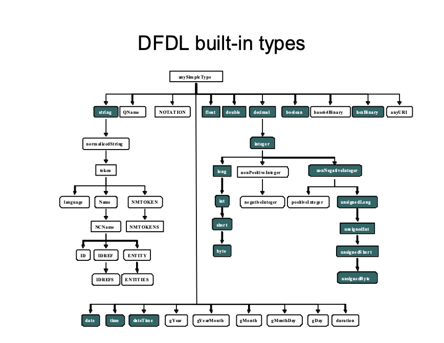

# 5. DFDL Schema Component Model

When using DFDL, the format of data is described by means of a _DFDL Schema_.

The DFDL Schema Component Model is shown in conceptual UML in Figure 2.

The shaded boxes have direct corresponding element syntax and therefore appear in DFDL schema. The unshaded boxes are conceptual classes often used in discussion of DFDL schemas. For example, the ModelGroup class is a generalization of Sequence and Choice classes which are the concrete classes corresponding to xs:sequence and xs:choice constructs of the schema. The class Term is a further generalization encompassing not only ModelGroup, but GroupReference, ElementReference, and ElementDeclaration.

Figure 2 DFDL Schema UML diagram

Each object defined by a class in the above UML is called a DFDL Schema component.

We express the DFDL Schema Model using a subset of the XML Schema Description Language \(XSD\). XSD provides a standardized schema language suitable for expressing the DFDL Schema Model.

A DFDL Schema is an XML schema containing only a restricted subset of the constructs available in full W3C XML Schema Description Language. Within this XML schema, special DFDL annotations are distributed that carry the information about the data's format or representation.

A DFDL Schema is a valid XML schema. However, the converse is not true in general since the DFDL Schema Model does not include many concepts that appear in XML schema.

## 5.1 DFDL Simple Types

The DFDL simple types are shown in Figure 3. The graph shows all the types defined by XML Schema version 1.0, and the subset of these types supported by DFDL are shown as shaded.

These types are defined as they are in XML Schema, with the exceptions of:

* String – In DFDL a string can contain any character codes. None are reserved. \(Including the character with character code U+0000, which is not permitted in XML documents.\)

The simple types are placed into logical type groupings as shown in this table:

| **Logical Type Group** | **Types** |
| :--- | :--- |
| Number | xs:double, xs:float, xs:decimal, xs:integer and its restrictions \(xs:int, xs:unsignedLong, etc.\) |
| String | xs:string |
| Calendar | xs:dateTime, xs:date, xs:time |
| Opaque | xs:hexBinary |
| Boolean | xs:boolean |

Table 1: Logical type groupings

Note that DFDL does not have specific types corresponding to time intervals, nor are there special numeric types for geo-coordinates, currency, or complex numbers. These concepts must be described in DFDL using the available Number types.

## 5.2 DFDL Subset of XML Schema

The DFDL subset of XSD is a general model for hierarchically nested data. It avoids the XSD features used to describe the peculiarities of XML as a syntactic textual representation of data, and avoids features that are simply not needed by DFDL.

The following lists detail the similarities and differences between general XSD and this subset.

DFDL Schemas consist of:

* Standard XSD namespace management
* Standard XSD import and management for multiple file schemas
* Local element declarations with dimensionality via XSD maxOccurs and XSD minOccurs.
* Global element declarations
* Complex type definitions with empty or element-only content models.
* DFDL appinfo annotations describing the data format
* These simple types: string, float, double, decimal, integer, long, int, short, byte, nonNegativeInteger, unsignedLong, unsignedInt, unsignedShort, unsignedByte, boolean, date, time, dateTime, hexBinary
* These facets: minLength, maxLength, minInclusive, maxInclusive, minExclusive, maxExclusive, totalDigits, fractionDigits, enumeration, pattern \(for xs:string type only\)
* Fixed values
* Default values
* 'sequence' model groups \(without XSD minOccurs and XSD maxOccurs or with both XSD minOccurs="1" and XSD maxOccurs="1"\)
* 'choice' model groups \(without XSD minOccurs and XSD maxOccurs or with both XSD minOccurs="1" and XSD maxOccurs="1"\)
* Simple type derivations derived by restriction from the allowed built-in types
* Reusable Groups: named model group definitions can only contain one model group
* Element references with dimensionality via XSD maxOccurs and XSD minOccurs.
* Group references without dimensionality
* Nillable attribute is "true" \(that is, nillable="true" in the element declaration.\)
* Appinfo annotations for sources other than DFDL are permitted and ignored
* Unions; the memberTypes must be derived from the same simple type. DFDL annotations are not permitted on union members.[\[1\]]()
* XML Entities
* The xs:schema “elementFormDefault” attribute
* The xs:element “form” attribute

Note: xs:nonNegativeInteger is treated as an unsigned xs:integer.

The following constructs from XML Schema are not used as part of the DFDL Schema Model of DFDL v1.0 schemas; however, they are all reserved[\[2\]]() for future use since the data model may be extended to use them in future versions of DFDL:

* Attribute declarations \(local or global\)
* Attribute references
* Attribute group definitions
* Complex type derivations where the base type is not xs:anyType.
* Complex types having mixed content models or simple content models
* List simple types
* Union simple types where the member types are not derived from the same simple type.
* These atomic simple types: normalizedString, token, Name, NCName, QName, language, positiveInteger, nonPositiveInteger, negativeInteger, gYear, gYearMonth, gMonth, gMonthDay, gDay, ID, IDREF, IDREFS, ENTITIES, ENTITY, NMTOKEN, NMTOKENS, NOTATION, anyURI, base64Binary
* XSD maxOccurs and XSD minOccurs on model groups \(except if both are '1'\)
* XSD minOccurs = ‘0’ on branches of xs:choice model groups
* Identity Constraints
* Substitution Groups
* xs:all groups
* xs:any element wildcards
* Redefine - This version of DFDL does not support xs:redefine. DFDL schemas must not contain xs:redefine directly or indirectly in schemas they import or include.
* whitespace facet
* Recursively defined types and elements \(defined by way of type, group, or element references\)

## 5.3 XSD Facets, min/maxOccurs, default, and fixed

XSD element declarations and references can carry several properties that express constraints on the described data. These constraints are mainly used for validation. These properties include:

* the facets
* minOccurs, maxOccurs
* default
* fixed

The facets and the types they are applicable to are:

* minLength maxLength \(for types xs:string, and xs:hexBinary\)
* pattern
* enumeration \(all types except xs:boolean\)
* maxInclusive, maxExclusive, minExclusive, minInclusive \(for types xs:float, xs:double, xs:date, xs:time, xs:dateTime, xs:decimal and all integer types descending from xs:decimal in Section 5.1\)
* totalDigits \(for type xs:decimal and all integer types descending from xs:decimal in Section 5.1\)
* fractionDigits \(for type xs:decimal\)

The facets \(but not XSD maxOccurs nor XSD minOccurs\) are also checked by the dfdl:checkConstraints DFDL expression language function.

The following sections describe these in more detail.

### 5.3.1 MinOccurs, MaxOccurs

The XSD minOccurs property is used:

* To determine if an element declaration or reference is an array, an optional element, or neither.
* If validating, to determine the minimum valid number of occurrences of an array both when parsing and unparsing.

The XSD maxOccurs property is used:

* To determine if an element declaration or reference is an array, an optional element, or neither.
* If validating, to determine the maximum valid number of occurrences of an array both when parsing and unparsing.

The XSD minOccurs and XSD maxOccurs values are interpreted in conjunction with the DFDL dfdl:occursCountKind property. For some values of dfdl:occursCountKind the XSD minOccurs and XSD maxOccurs are either ignored, enforced, or used for validation checking only. See Section 16, Properties for Array Elements and Optional Elements, for more details.

### 5.3.2 MinLength, MaxLength

These facets are used:

* When dfdl:lengthKind is "implicit" and type is xs:string or xs:hexBinary. In that case the length is given by the value of the XSD maxLength facet. In this case the XSD minLength facet is required to be equal to the XSD maxLength facet \(Schema Definition Error otherwise\).
* For validation of variable length string elements.

### 5.3.3 MaxInclusive, MaxExclusive, MinExclusive, MinInclusive, TotalDigits, FractionDigits

* Used for validation only

The format of numbers is not derived from these facets. Rather DFDL properties are used to specify the format.

### 5.3.4 Pattern

* Allowed only on elements of type xs:string or types derived from it in Section 5.1.
* Used for validation only

It is important to avoid confusion of the pattern facet with other uses of regular expressions that are needed in DFDL \(for example, to determine the length of an element by regular expression matching\).

Note: in XSD, pattern is about the lexical representation of the data, and since all is text there, everything has a lexical representation. In DFDL only strings are guaranteed to have a lexical and logical value that is identical.

### 5.3.5 Enumeration

Enumerations are used to provide a list of valid values in XSD.

* Used for validation only

Note: in DFDL we do not use XSD enumeration as a means to define symbolic constants. These are captured using dfdl:defineVariable constructs so they can be referenced from expressions.

### 5.3.6 Default

The XSD default property is used:

* To provide the logical value of a required element while parsing when the element is empty. See 9.5 Element Defaults.
* To provide the logical value of a required element when unparsing when element is missing. See 9.5 Element Defaults.

Note that the XSD fixed and XSD default properties are mutually exclusive on an element declaration.

### 5.3.7 Fixed

The XSD fixed property is used in the same ways as the XSD default property but in addition:

* To constrain the logical value of an element when validating.

Note that the XSD fixed and XSD default properties are mutually exclusive on an element declaration.

## 5.4 Compatibility with Other Annotation Language Schemas

A DFDL Schema only applies DFDL annotations on a subset of the XML Schema constructs. Hence, we normally think that a DFDL schema cannot contain any of the constructs outside of the DFDL subset. For example, the DFDL subset of XML Schema does not use attributes, hence, a DFDL schema normally would not contain attribute declarations.

There is an exception to this, however. One reason to xs:include/xs:import another XML schema file is purely for its use in validating annotations within the schema itself. Such an XML schema is describing not data, but a schema language extension - annotations to be used in the rest of the schema.

Hence, the complete set of files making up a schema by way of xs:include/xs:import may include a mixture of DFDL schemas that use only the DFDL subset of XSD, as well as other XML Schemas that describe annotations. These annotation schemas are unrestricted by the DFDL subset of XML Schema. For example, they are very likely to describe elements containing xs:attribute declarations.

A DFDL processor needs a way to tell these schema files apart so that it can enforce the DFDL subset in schema files that are describing data formats and ignore the XML schema files that are for unknown annotation languages that are to be ignored by the DFDL processor.

Hence, this rule: a DFDL implementation MUST ignore any schema file included or imported by a DFDL schema if the top level xs:schema element of that included/imported schema does not have an XML namespace binding for the DFDL namespace.

